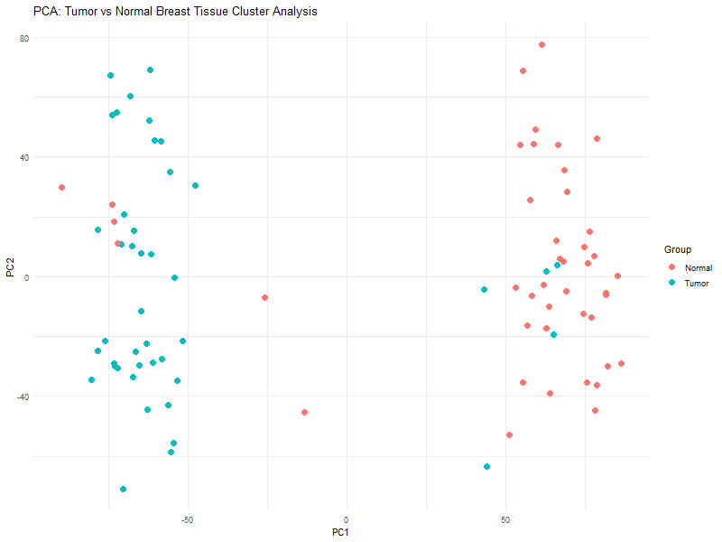
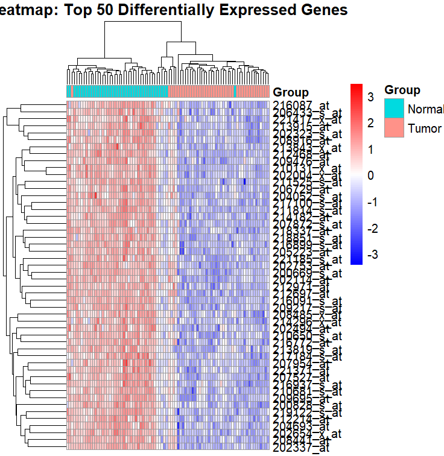

# Breast Cancer Genomics — Differential Gene Expression Analysis

Differential gene expression (DGE) analysis of breast cancer vs. normal tissue samples from the **GEO dataset GSE15852**, using R and Bioconductor. The analysis identifies genes significantly up- or down-regulated in tumor tissue and visualizes sample clustering and expression patterns.

## 🧬 Background

Breast cancer involves widespread dysregulation of gene expression. By comparing transcriptomic profiles of tumor and normal samples, we can identify candidate driver genes, potential biomarkers, and pathways enriched in disease. This analysis uses a publicly available microarray dataset (GSE15852) containing breast cancer and matched normal tissue samples.

## 🔧 Tools & Methods

| Tool | Purpose |
|---|---|
| R / Bioconductor | Core analysis environment |
| GEOquery | Data retrieval from NCBI GEO |
| limma / DESeq2 | Differential expression statistical testing |
| ggplot2 | Visualization |
| pheatmap | Top gene heatmap |
| PCA | Sample clustering and quality check |

**Dataset:** [GSE15852](https://www.ncbi.nlm.nih.gov/geo/query/acc.cgi?acc=GSE15852) — breast cancer microarray, NCBI GEO

## 📊 Results

### PCA — Sample Clustering

Principal Component Analysis shows clear separation between tumor and normal samples along PC1, confirming that the largest axis of variation in the data corresponds to disease state. This validates sample quality and the biological signal in the dataset.



### Top 50 Differentially Expressed Genes — Heatmap

The heatmap displays the 50 most significantly differentially expressed genes, hierarchically clustered by expression profile. Tumor samples (top cluster) show consistent upregulation of proliferation-associated genes and downregulation of tissue-specific markers relative to normal tissue.



## 📁 Repository Structure

```
Breast-Cancer-Genomics-DGE/
├── breast_cancer_DGE_analysis.R   # Full annotated R analysis script
├── PCA_Plot.png                   # PCA cluster visualization
├── Heatmap.png                    # Top 50 DEG heatmap
└── README.md
```

## ▶️ How to Run

```r
# Install required packages (first time only)
if (!requireNamespace("BiocManager", quietly = TRUE))
    install.packages("BiocManager")
BiocManager::install(c("GEOquery", "limma", "pheatmap"))

# Run the analysis
source("breast_cancer_DGE_analysis.R")
```

## 🔗 Data Source

- [NCBI GEO: GSE15852](https://www.ncbi.nlm.nih.gov/geo/query/acc.cgi?acc=GSE15852)

## 👩‍🔬 Author

**Yusra Amena** — Biological Sciences (Genetics & Cell Biology), SIUE  
[LinkedIn](https://www.linkedin.com/in/yusra-amena-a6a991248/) · [GitHub](https://github.com/yusraamena20)
